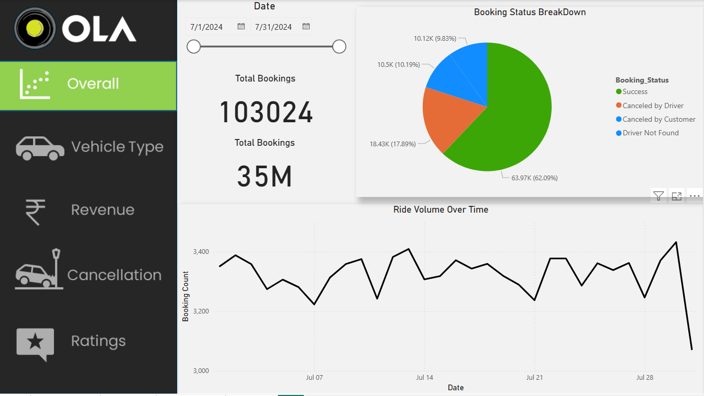

# 🚖 Ola Ride Analytics Dashboard 📊

## 📌 Overview  
This Power BI dashboard provides insights into Ola ride trends, customer behavior, and revenue patterns.

## 🔥 Key Features  
✅ **Ride Volume Over Time** – Track ride trends over days & months.  
✅ **Booking Status Breakdown** – Analyze completed vs. canceled rides.  
✅ **Customer & Driver Ratings** – Compare ratings to assess service quality.  
✅ **Revenue by Payment Method** – Identify top payment trends.  

## 📷 Dashboard Screenshots  

## 📂 Files Included  
- `Ola_Ride_Analytics.pbix` – Power BI dashboard file  
- `sample_data.csv` – Sample dataset  
- `screenshots/` – Key visuals  

## 🚀 How to Use  
1. **Download** the `.pbix` file.  
2. **Open** it in **Power BI Desktop**.  
3. **Connect** to your dataset if needed.  

---

📌 **Author:** *Mayuresh Hole* | ✉️ *mayuresh.hole@gmail.com*  
⭐ **Feel free to explore, fork, and suggest improvements!**  
